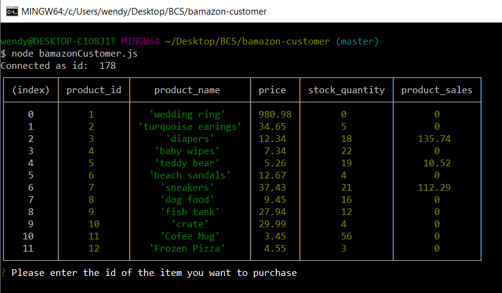

# Bamazon app

## Customer Level

The app will take in orders from customers and deplete stock from the store's inventory.

The Database and table used for this app are:

```MySQK
CREATE DATABASE bamazon;

CREATE TABLE bamazon_products (
	product_id INT (30) NOT NULL AUTO_INCREMENT PRIMARY KEY,
    product_name VARCHAR (50),
    department_name VARCHAR (50),
    price FLOAT (30, 2),
    stock_quantity INT (30)
);
```

To run this application, please type the following in the console: 

```
 node bamazonCustomer.js
 ```

Running this application will:

* Display all of the items available for sale. Include the ids, names, and prices of products for sale.



* The app will then prompt users with two messages:

    1. The first should ask them the ID of the product they would like to buy.

    2. The second message should ask how many units of the product they would like to buy.

Once the customer has placed the order, the application will:

* Check if the product exists in the inventory. If not, it will display an error message and restart.


* Check if the store has enough of the product to meet the customer's request.

    - If not, the app logs a phrase like Insufficient quantity!, and then prevents the order from going through.

    

    - However, if the store does have enough of the product, the app will fulfill the customer's order.

    * This means updating the SQL database to reflect the remaining quantity.

    * Once the update goes through, show the customer the total cost of their purchase.

     

## Level 2

Create a new Node application called bamazonManager.js. Running this application will:

* List a set of menu options:


1. If a manager selects View Products for Sale, the app will list every available item on a table: 


2. If a manager selects View Low Inventory, then it will 
    - list all items with an inventory count lower than five.

    

3. If a manager selects Add to Inventory, the app will
    - display a prompt that will let the manager "add more" of any item currently in the store.

      

4. If a manager selects Add New Product, the app will allow the manager to 
    - Add a completely new product to the store.

    

5. If the manager selects EXIT, the app will end its process.

    